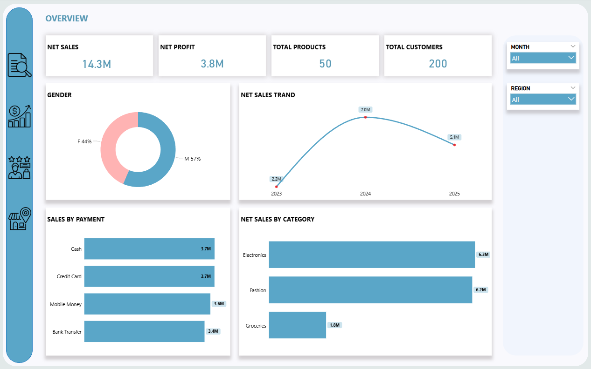
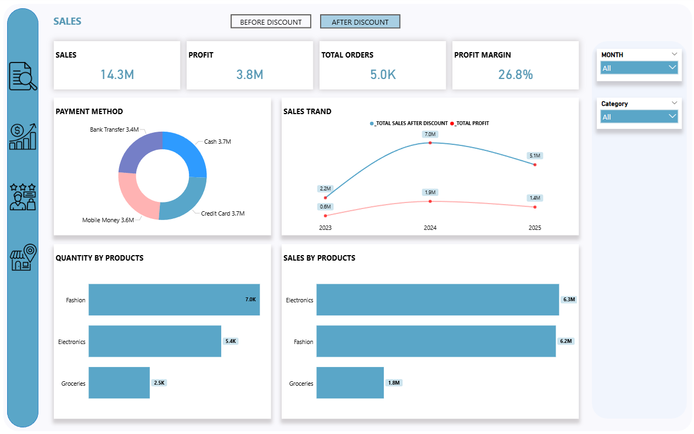
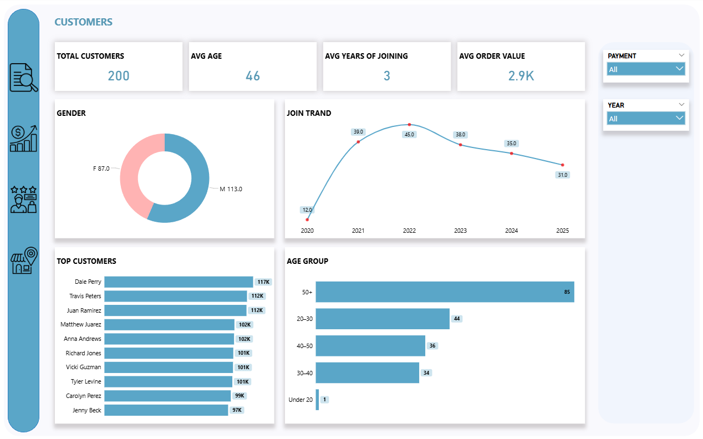
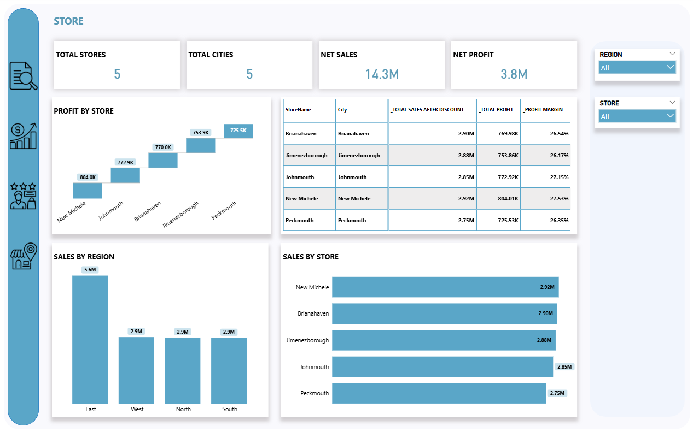

🎓 NTI Graduation Project | Data Analysis Using Power BI

📌 Project Overview
This project is my graduation project for the **NTI Data Analysis Track**.
It focuses on end-to-end data analysis and building interactive Power BI dashboards
to analyze sales, customers, and store performance.

---

🎯 Project Objectives
- Analyze overall sales and profitability
- Understand customer behavior and demographics
- Evaluate product and category performance
- Measure store and regional performance
- Track trends over time to support decision-making

---

🗂 Data Description
- Sales transactions data
- Customer demographic data
- Product and category data
- Store and regional information
- Data cleaning and transformation were performed using **Power Query**

---

🛠 Tools & Technologies
- Power BI
- Power Query
- DAX
- Excel

---

## 📊 Dashboard Pages

🔹 Overview
High-level KPIs including net sales, profit, customers, and overall trends.

---

🔹 Sales Analysis
Detailed sales performance analysis before and after discounts,
including payment methods, products, and sales trends.

---

🔹 Customer Analysis
Customer demographics, age groups, top customers,
and customer joining trends over time.

---

🔹 Store Analysis
Store and regional performance analysis,
including profit by store, sales by region, and store comparison.

---

📈 Key Insights
- Net sales reached **14.3M** with a profit of **3.8M**
- Electronics and Fashion are the top-performing categories
- Customers aged **50+** represent the largest customer segment
- East region generates the highest sales among all regions
- Store-level analysis highlights performance differences across locations

---

📁 Project Files
- NTI_Graduation_Dashboard.pbix
- Dataset files
- Dashboard screenshots

---

🎓 Project Value
This project demonstrates:
- Full data analysis workflow
- KPI design and business storytelling
- Advanced Power BI reporting
- Real-world analytical thinking

📌 Developed as part of the **NTI Graduation Project**.
